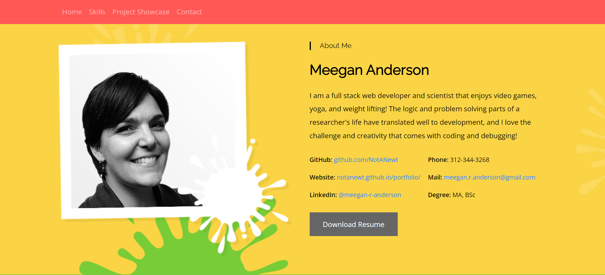
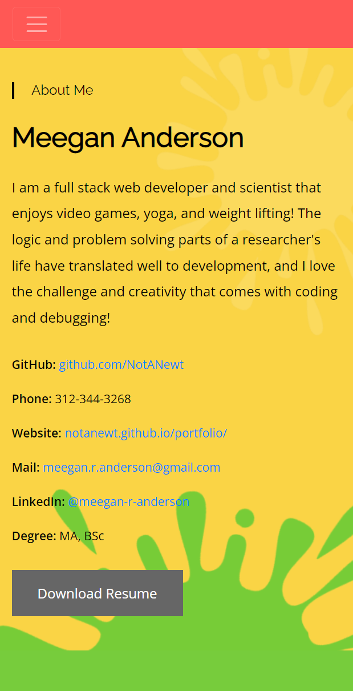

# Meegan's Portfolio

## Description

- Purpose of this project: A portfolio of my dev work.
- Languages used: HTML, CSS
- Brief description: A portfolio that includes my bio, a list of skills, a showcase of my projects with individual pages for each, and ways to contact me.

## Table of Contents

- [Usage](#usage)
- [Screenshots](#screenshots)
- [License](#license)
- [Questions](#questions)
- [Links](#links)

## Usage

When a user opens the portfolio page, they are presented with a navigation bar with links to the individual sections of the document: Home, Skills, Project Showcase, and Contact. At the top of the page is the About Me section, which has a brief biography, my phone number, my email, links to my github and linkedIn profiles, and a button to download my resume. When the user scrolls down or clicks on the "Skills" link in the nav, they will see the Skills section with a breakdown of my skills and my education history. When the user scrolls down further or clicks on the "Project Showcase" link in the nav, they are presented with cards with icons for each project. When the user hovers over the cards on a desktop or clicks on them on mobile, an card appears over the icon with the application's title, a brief description, the tools used in its development, and a "Project Details" button. If the user clicks on the "Project Details" button, they are taken to a page for that application, which includes the project's title, a screen shot, a brief description, links to the deployed application, a link to the github repository, and a button to download the project as a zip file. The navigation bar, Contact section, and footer are the same on the project details pages as on the home page. When the user clicks on any of the links in the navigation bar, they are returned to the home page to the section they clicked. Below the Project Showcase is a banner asking if the user would like to work with me, and a button to download my resume. If the user continues to scroll or clicks on the "Contact" link in the nav, they are presented with my phone number, email, and linkedIn contact information. The footer includes links back to previous sections of the portfolio, as well as my phone number, email, and linkedIn contact information.

## Screenshots

### Screenshot of Portfolio's Home Page When Viewed On A Desktop

### Screenshot of Portfolio's Home Page When Viewed On Mobile

### Screenshot of Portfolio's Home Page

!["Screenshot of portfolio's home page, zoomed out so the entire page can be seen. The image includes navigation bar at the top and a yellow biography section, including a headshot and contact links. Below is a green skills section that lists skills and education. Below that is a yellow Project Showcase section with white cards with icons for each of the projects. Further down is a red section with a button to download Meegan's resume. Next is a yellow Contact section with contact links. At the bottom is a blue footer section with contact links."](./assets/img/portfolio_v3_desktop_large_ss.png)

## License

This application is licensed under the MIT license.

## Questions

If you have any questions:

- Email me: [meegan.r.anderson@gmail.com](mailto:meegan.r.anderson@gmail.com)
- Go to my github: [NotANewt](https://github.com/NotANewt)

## Links

- Here is the repo: [NotANewt/Meegan's Portfolio](https://github.com/NotANewt/portfolio)
- Here is the pages: [NotANewt/pages](https://notanewt.github.io/portfolio/)
