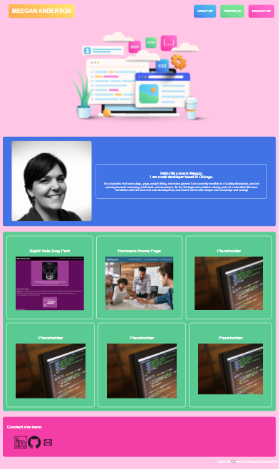

# Meegan Anderson's Portfolio

# Description

This is my deployed portfolio of my previous work. When the portfolio is loaded, the user is presented with my name, a recent photo or avatar, and links to sections about me, my work, and how to contact me.

When the links in the navigation are clicked, the UI scrolls to the corresponding section. When the user clicks on the link to the section about my work, the UI scrolls to a section with titled images of my applications. When the user hovers over an application, the box grows in size. When the user clicks on the application's image, they are taken to the deployed application in a new tab.

When the user resizes the page or views the site on various screens and devices, they will be presented with a responsive layout that adapts to their viewpoint.

# Screenshot

## Links To Application:

- Here is the repo: [NotANewt/portfolio](https://github.com/NotANewt/portfolio)
- Here is the pages: [NotANewt/pages](https://notanewt.github.io/portfolio/)
